# MTH 5401 Final Project

### David E. Nieves-Acaron 
### MTH 5401 
### Dr. Nezamoddini-Kachouie Nezamoddin 

**Abstract**

Learning to model data is a critical skill for many areas of research, particularly when said data presents an
opportunity for real world intelligence-based decision as is seen in many top-performing companies and organizations. In
this project, a rudimentary analysis of the `state.x77` database is performed by modelling two response variables, by
grouping these responses, and by clustering the associated data points. In particular, income and life expectancy of all
fifty states of the union is performed by using a variety of linear models. The grouping is used to then analyze the
average life expectancy of three groups (low income, medium income, and high income). Finally, some additional groups
are formed using K-Means and Fuzzy C-Means clustering. The results consist of the following: the `Income` and `Life Exp`
data contains some important correlations which contributed to the development of the model as seen in the **Results**
section; some models were developed using a combination of a brute force and a genetic algorithm for the interaction
terms, with the Adjusted $R^2$ reaching values as high as 0.7876 and 0.7305 for `Income` and `Life Exp`, respectively;
finally, the ANOVA results for the `HS Grad` and `Life Exp` values between different income groups showed that there is
indeed a significant difference between the Medium Income and High Income groups and the Low Income groups in terms of
Life Expectancy, as well as a significant difference in High School graduation rates; the results of the clustering show
that the best number of clusters was around 5 or 6, with the best features involving the `Population`, `Area`, and `HS
Grad`. <!-- TODO: Fix the conclusion on ANOVA results -->

<!-- TODO: Add a CONCLUSION -->

**Introduction**

The data for this project comes from a 1977 census by the United States Department of Commerce as seen in [1]. It has 8
columns consisting of the following: (state name); `Population Income`, the per capita income in 1974; `Illiteracy`, the
illiteracy as a percent of the population in the year 1970;   `Life Exp`, the life expectancy in the years 1969 to 1971;
`Area`, the land area in square miles; `Murder`, the murder and non-negligent manslaughter rate per 100,000 population
in 1976; `HS Grad`, the High School graduation rate in 1970; finally, `Frost`, mean number of days with minimum
temperature below freezing (1931-1960) in a capital or large city. The goal is to model two of the variables: `Life Exp`
and `Income` with respect to the other predictors. 

The importance in this type of exercise lies in using one's analytical skills to be able to make real-world intelligent
decisions. Given the nature of the data being worked with, one could easily see this type of analysis being performed
for policymakers who would like to perform more intelligence-based decision making. 

**Methods**

   A simple linear regression model consists of a model of the form:

   $$ \hat{y_i}  = \hat{\beta_0} + \hat{\beta_1} x_{i1} + \ldots + \hat{\beta_k} x_{ik} $$ 

... where $y_i$ is the respose value, $\beta_i$ is a parameter, $x_i$ is a variable, and $\hat{\cdot}$ indicates an
   estimate.

This model attempts to explain the observations of the form:

$$
y_i  = \beta_0 + \beta_1 x_{i1} + \ldots + \beta_k x_{ik} + \epsilon_i
$$ 

... where $\epsilon_i$ is normally distributed with a mean of 0 and a standard deviation of $\sigma$. The assumptions
behind linear regression involve the following:
- Existence of the data, i.e. $y_i < \infty , \ \forall i$
- Linearity of the data
- Normality of the response 
- Independence of $y_i$
- Homoscedasticity, or a homogeneity of the variance

When these assumptions are not met, or are egregiously wrong with respect to the data being used, the results of the
linear regression model can be quite skewed and the model will not be very accurate. It should be noted that there can
be some deviation with respect to these assumptions that still allow for the model to work properly. 

The $R^2$ is a metric that attempts to measure the ratio of explained variance of a model over the total variance of the
data. The formula for $R^2$ is as follows.

$$ R^2 = 1 - \frac{\text{SSE}}{\text{SST}} $$  

... where $\text{SSE}$ is the sum of squared error , i.e. 

$$ \sum_{i=1}^{n} (y_i - \hat{y}_i)^2 $$ 

and the $\text{SST}$ is the total sum of squares ,i.e. $S_{yy}$ or in other words,

$$ \sum_{i=1}^{n} (y_i - \overline{y})^2 $$ 

In general, the more predictors there are, the higher $R^2$, which can lead to misleading results. As a result, the
Adjusted $R^2$ metric was developed since it takes into account the degrees of freedom for the model and for the average
used in $S_{yy}$}.} }The formula for Adjusted $R^2$ is thus

$$ \text{Adj. } R^2  = 1 - \frac{\frac{\text{SSE}}{\text{\#DoF SSE}}}{\frac{\text{SST}}{\text{\#DoF SST}}} $$ 

... where $\text{\#DoF SSE}$ is usually $n-(k+1)$ for a multiple regression model with $k$ non-categorical predictors,
and $\text{\#DoF SST}$ is usually $n-1$ for simple multiple regression.

Alternatively, the formula for obtaining Adjusted $R^2$ from regular $R^2$ is the following:

$$ \text{Adj. } R^2 = 1 - \frac{(1 - R^2) (n - 1)}{n - (k+1)} $$ 

$$ \vec{y} = \vec{\beta} \cdot \vec{x} $$ 

... where $y_i$ is of size  $n$,  $\vec{\beta}$ is of size  $n \times k$, and $x$ is of size  $n \times 1$.

A list of all combinations of base variables was made using the `combn` function from R. This allowed for the creation
of all possible combination of predictors in a single formula as a string object. Once that collection of string objects
was created, the members of the collection were used to analyze the performance of the linear regression model. An
interactive representation of the models' performances was created using the Plotly library in R. The benefit of Plotly
mainly lies in the customizability and the feature of allowing for hover labels which showcase a printout of each
model's summary when hovering over a specific model's dot (see picture below). 

The reader is *highly* encouraged to inspect these plots using a web browser.

After this was performed, the best model was chosen from the "base model", i.e. the one which had no interaction terms.
From this base model, some interaction terms were added to test and see how they would affect model performance. Given
the large amount of combinations present in the interaction terms, a simple algorithm was used for this, whereby out of
all the possible set of interactions, the interaction which best affected the model was chosen to further enhance it and
hopefully improve. Specifically, the model with the interaction term which most increased the adjusted $R^2$ was chosen.
From this, the model with the maximum adjusted $R^2$ was chosen. 

Given the relatively cheap computational performance of $\approx O(2^n)$ combinations of linear regression models on a
modern day computer with $n = 6$, all the combinations were attempted for the *base* models, with these referring to ones which
contain no interaction terms. From there, a the use of the Plotly library ensued to display not only the selected axes
corresponding to the models' metrics (with these being Adjusted $R^2$ vs number of variables), but also the printout of
each model's summary using the hovertext feaure of the library. An example of this can be seen below:

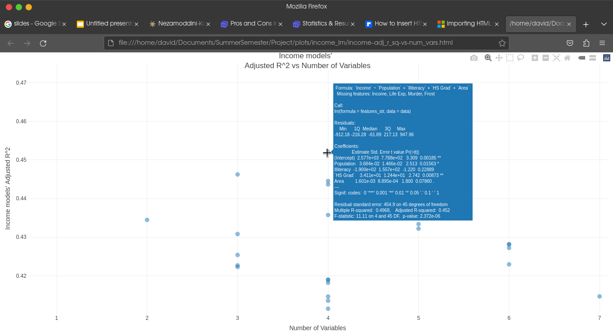

*Figure I: Plot showing the hover feature of Plotly which allows relevant data to be shown when hovering over a data point on a
per-point basis.*

For clustering, a similar approach was taken by seeking to minimize the within cluster sum of squares while maximizing
the between cluster sum of squares over the total sum of squares. 

An ANOVA test attempts to determine if there is a significant difference between the averages of two groups. It does so
by calculating what is known as an $F$ statistic and testing it. In its essence, it is a ratio of two variances. The
motivation behind it lies in the fact that in a set of data points organized into different groups, the variation within
the data can be broken into variation between the groups and variation between the groups. As a result, a data
distribution that exhibits  a relatively small within-group variation and a relatively large between-group variation
should indicate the significance of the groups, because if the groups were not significant, the within-group variation
would not differ much from the between-group variation. 

For that reason, one tests the ratio of the within-group variation and between-group variation to see if it is
significant enough using the $F$ distribution.

Regarding the F-distribution, for any ratio of two chi-squared random variables $\chi^2_1$ and $\chi^2_2$, with $n_1$
and $n_2$ degrees of freedom respectively, the ratio of the two like so:

$$ F = \frac{\frac{\chi^2_1}{n_1}}{\frac{\chi^2_2}{n_2}} $$ 

has an $F$ distribution with $n_1$ and $n_2$ degrees of freedom, respectively. 

The $F$-statistic consists of 
$$F = \frac{\text{between-group variation}}{\text{within-group variation}}$$ 

K-means clustering is an unsupervised machine learning algorithm that attempts to group data points together by
iteratively taking the mean of the points in the data, assigning each point a new center based on that mean, and then
recalculating the mean based on the newly assigned points. Specifically, at the beginning of the algorithm, there will
be some points $x_i \in \mathbb{R}^d$ in a distribution and a value for $k$ will be chosen preemptively to best perform
clustering. The method of choosing the best value for $k$ will be discussed shortly. Initially, the values of the means
of each For each iteration, each point will be given a membership to a certain cluster based on the lowest eucledian
distance, as denoted by:

$$
c_i := \text{arg} \underset{j}{\text{min}} || x_i - \mu_j||^2
$$ 

Then, the mean of each cluster will be recomputed according to the following formula:
 $$
\mu_j := \frac{\sum_{i=1}^{n} \mathbb{1}_{c_i = j}x_i}{\sum_{i=1}^{n} 1_{c_i = j}}
$$ 

... where $1_{c_i = j}$ is the indicator function that returns a  $1$ when the condition of $c_i = j$ is met. 

**Results**

   One of the first tasks undertaken in this project was analyzing the data by visualizing a correlation matrix using
   the `ggpairs` function. This resulted in the following plot seen below.

   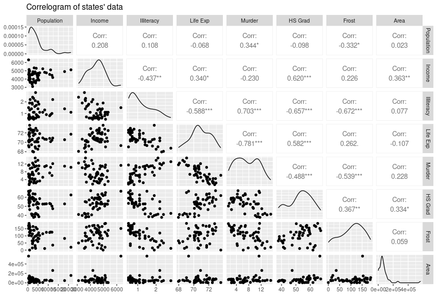

   *Figure II: Correlogram of the data points. As can be seen, the data is far from normal, and there are some key correlations
       for the `Income` and `Life Exp` responses*

   As can be seen from this correlogram, there are some notable correlations for the two response variables of interest,
   `Income`, and `Life Exp`. For `Life Exp`, the strongest correlations correspond to `Illiteracy` (-0.588), `Murder`
   (-0.781), `HS Grad` (0.582), and `Income` (0.340).  For the `Income` variable, the strongest correlated variable is
   `Illiteracy` (0.620), but there are other terms such as `Life Exp` (0.340), `Illiteracy` (-0.437), and `Area` (0.363)
   which still have a medium to strong correlation. For this reason, it is no surprise that later on, the models with
   some of the strongest results made use of these predictors. In addition to these correlations, it can be seen from
   this plot that the distributions of each of the predictors and responses are far from normal, which undermines the
   assumptions of linear regression.

   The best model for the `Life Exp` response was the following:

   $$ \begin{aligned} \text{Life Exp} ~ &
   \text{Population}
   + \text{Murder} + \text{HS Grad} + \text{Frost}  + \\ &  \text{Population}:\text{Murder}  +
       \text{Population}:\text{Frost}  +  \\ &  \text{Population}:\text{Area}  +  \\ & \text{Murder}:\text{Frost}  +  \\
       & \text{Illiteracy}:\text{Murder}  + \\ &  \text{Illiteracy}:\text{HS Grad}  + \\ &   \text{Murder}:\text{HS
       Grad}  + \\ &  \text{Income}:\text{Frost}  +  \\ & \text{Income}:\text{Murder}  +  \\ & \text{Frost}:\text{Area}
       + \\ & \text{HS Grad}:\text{Area} \end{aligned} $$ 

It obtained an $R^2$ score of 0.7876 and an Adjusted $R^2$ score of 0.8526.
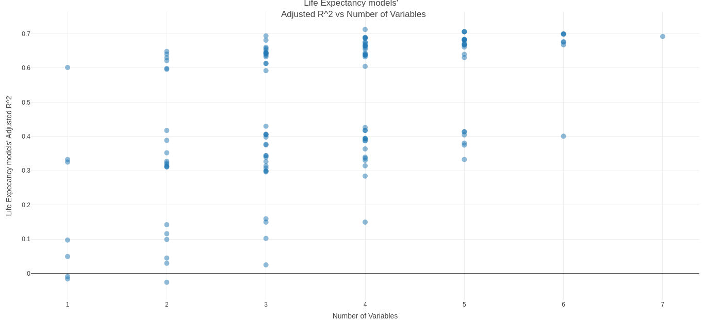

*Figure III: Screenshot showing the Adjusted $R^2$ for the life expectancy models against the number of variables for only the
*base* models which do not contain interactions.*

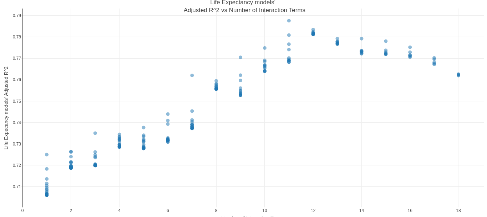

*Figure IV: Screenshot showing the Adjusted $R^2$ for the life expectancy models against the number of variables for the models
with interaction terms*

The best model for modelling the `\text{Income}` response was the following:

$$ \begin{aligned} \text{Income} \sim & \
\text{Population} + \text{Murder} + \text{HS Grad} + \text{Frost}  \\ &   \text{Murder}:\text{HS Grad}  +
\text{Frost}:\text{Area}  + \\ &   \text{Life Exp}:\text{Area}  +   \text{Murder}:\text{Area}  + \\ &
\text{Illiteracy}:\text{Murder}  +   \text{Life Exp}:\text{Frost}  + \\ &   \text{Life Exp}:\text{Murder}  +
\text{Illiteracy}:\text{HS Grad}  + \\ &   \text{Population}:\text{Illiteracy}  +   \text{HS Grad}:\text{Frost}  + \\ &
\text{Population}:\text{Frost}  +   \text{Population}:\text{Area} + \\ & \text{Life Exp}:\text{HS Grad} \end{aligned} $$

It obtained an $R^2$ score of 0.824 and an Adjusted $R^2$ score of 0.7305.
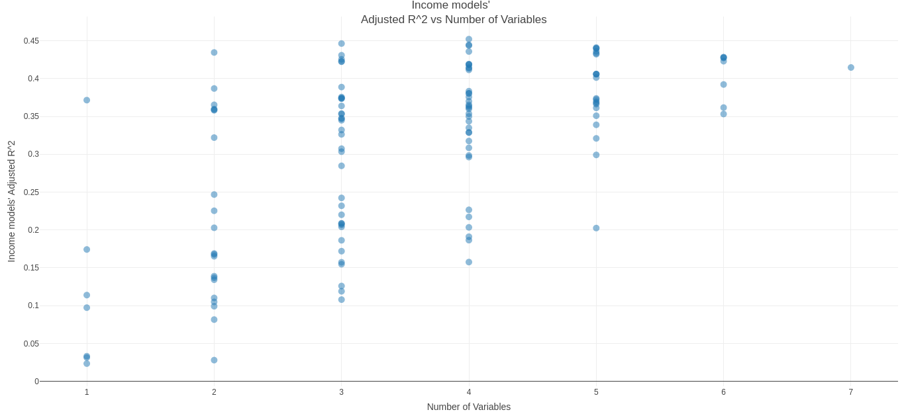

*Figure V: Plot showing adjusted $R^2$ vs the number of variables in the base models for the `Income` model.*

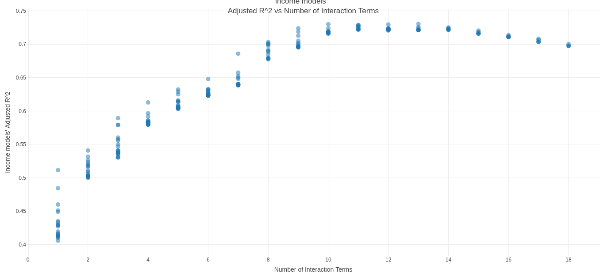

*Figure VI: Plot showing adjusted $R^2$ vs the number of interaction terms in the interaction models for the `Income` model.*

After that, some beginning modelling was performed using the `Life Exp` predictor. This allowed for the easy inspection
of models to be able to 

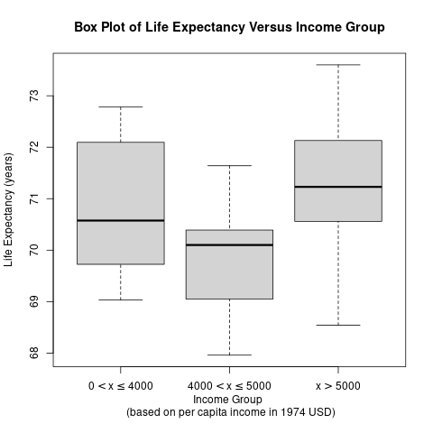

*Figure VII: Plot showing the boxplot generated by grouping the data points by `Income` and seeing the boxplots for the `Life Exp`
values.*

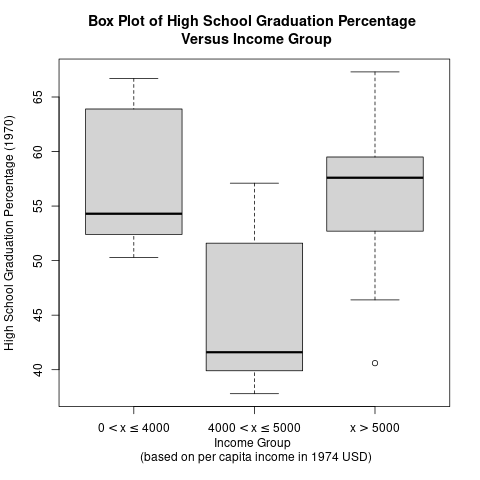

*Figure VIII: Plot showing the different box plots generated by grouping the data points according to income and comparing the values
for `HS Grad` accordingly.* 

From the results of the above plot, there is clearly a difference  between the averages of the middle income group and
the other two groups. This is further validated by the results of the ANOVA test seen below. 

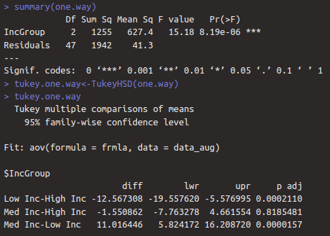

*Figure IX: Plot showing the output of the ANOVA test for `HS Grad` with respect to `Income`.*

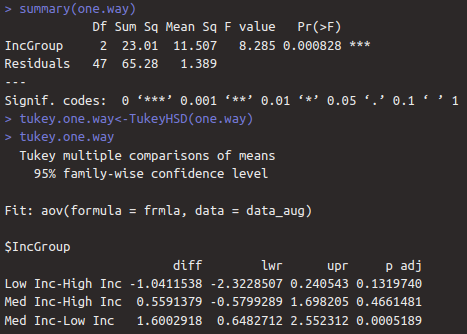

*Figure X: Plot showing the output of the ANOVA test for `Life Exp` with respect to `Income`.*

Moreover, the results of the Tukey Honest Significant Differences test from using the `TukeyHSD` function reveals that
the main difference in the `HS Grad` between income groups lies between the Low Income and High Income as well as the
Medium Income and Low Income.

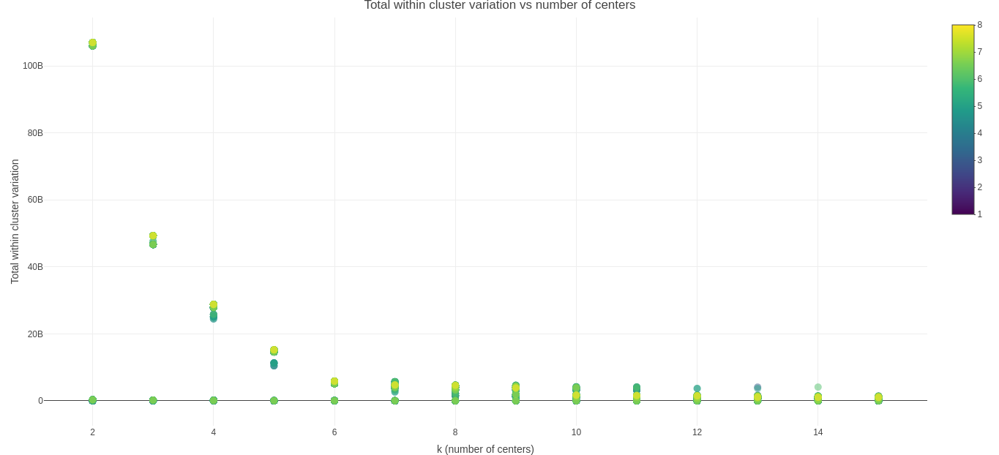 

*Figure XI: Plot showing the elbow plot for the $k$-means clustering runs. The color indicates how many predictors were used. From
what can be seen here, a value of $4$ or $5$ would be most appropriate for the algorithm.*

*Figure XII: Plot showing a sort of inverse elbow plot for the $k$-means clustering runs, specifically with respect to $\frac{\text{between SS}}{\text{total SS}}$. For a better clustering, this should be maximized to approach the maximum value of $1$. The color indicates how many predictors were used.*

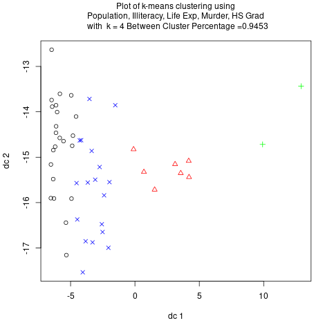

*Figure XIII: Plot showing the results of a $k$-means clustering with $k = 4$ and the associated $\frac{\text{between SS}}{\text{total SS}}$ showing a value of 0.9453.* 

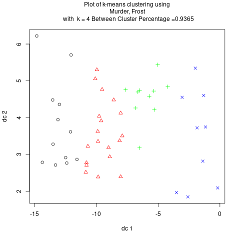

*Figure XIV: Plot showing the results of a $k$-means clustering with $k = 4$ and the associated $\frac{\text{between SS}}{\text{total SS}}$ showing a value of 0.9365.* 

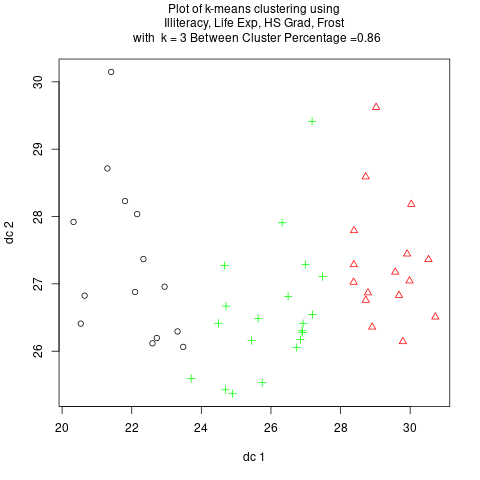

*Figure XV: Plot showing the results of a $k$-means clustering with $k = 4$ and the associated $\frac{\text{between SS}}{\text{total SS}}$ showing a value of 0.86.* 

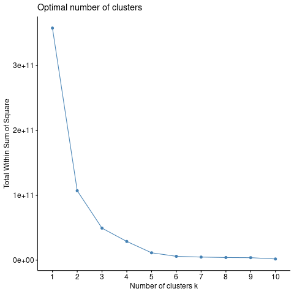

*Figure XVI: Plot showing the elbow plot of the fuzzy c-means clustering. As can be seen, a value of $4$ or $5$ is once again most
appropriate for clustering.*

**Conclusion**

In conclusion, the results of the `Income` and `Life Exp` response modelling show that the best predictors for both were
`Population`, `Murder`, `HS Grad`, and `Frost`. Adding interaction terms improved the performance of the models
significantly. As can be seen in the modelling of the `Income` response variable, it caused an increase in the Adjusted
$R^2$ score from 0.452 to 0.7305. For the ANOVA results, it was seen that there exists a significant difference between
the High School Graduation Percentage, and the Life Expectancy of different income groups. 

With regards to the clustering results, it was seen that the optimum number of clusters was around 5 or 6, and the `Population`, `Area`, and
`HS Grad` predictors were some of the most important ones. For future efforts, a deep dive could be performed so as to
analyze the normality of the residuals of each model to take it into account with the results of the other models and thus 
In addition, ANOVA tests for all the models as well as a more comprehensive investigation of the interaction terms could
be undertaken to take into account other relationships that could exist between the different predictors such as perhaps
nonlinear relationships. 

Finally, the following will attempt to assign some meaning to the results of this project. Following the political
movement known as rationalism, one's actions and decisions should be based on reason. While this can hold some meaning
in one's personal life, this is mainly with respect to the actions undertaken by governments around the world, as their
actions can have consequences on many people, even outside of their own jurisdiction. For that reason, gathering
intelligence and analyzing data is ever so crucial, which is why this project is relevant. One conclusion that could be
obtained from this project is that it seems that if one were to wonder where to focus on raising High School graduation
rates with respect to income groups, the low income groups would be the natural choice as they have been shown to have a
different mean High School graduation rate with respect to the others. 

**References**

[1] U.S. Department of Commerce, Bureau of the Census (1977) Statistical Abstract of the United States, and U.S. Department
of Commerce, Bureau of the Census (1977) County and City Data Book

[2] Penn State University. (n.d.). 4.2 - the F-distribution: Stat 415. PennState: Statistics Online Courses.
https://online.stat.psu.edu/stat415/lesson/4/4.2

[3] Course materials from Dr. Nezamoddini-Kachouie Nezamoddin 

